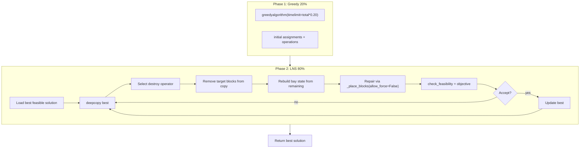

# Greedy + LNS 하이브리드 솔버 설계

> **상태:** 리뷰 반영 v2 — 사용자 승인 대기  
> **목표:** 대회 objective (w1·obj1 + w2·obj2 + w3·obj3) 최대화  
> **시간 배분:** 그리디 20% / LNS 80%  
> **범위:** 하이브리드 (그리디 seed + LNS 국소 탐색)

---

## 1. 배경 및 문제 정의

### 1.1 현재 baseline_greedy.py 요약

| 단계 | 내용 |
|------|------|
| Phase 1 | EDD+SPT 순서로 블록 배치. (베이, 방향, 위치) 전수 탐색 + 가장 이른 크레인-가능 슬롯 |
| Phase 2 | `check_feasibility` 위반 블록을 반복 수리 (greedy/simple 모드) |
| 점수 | w1×tardiness + w2×부하불균형 + w3×선호도페널티 + w4×top_y |

### 1.2 baseline 한계 (objective 관점)

1. **그리디 근시안** — 한 번 커밋한 배치를 되돌리지 않음
2. **가장 이른 슬롯 고정** — due date 여유가 있어도 늦은 슬롯(더 나은 공간 배치) 미탐색
3. **EDD 순서** — obj3(선호도), obj2(부하균형)에 불리할 수 있음
4. **수리/강제배치** — `_force_place`는 feasible은 보장하나 objective 희생 큼

### 1.3 예시 인스턴스 진단 (`example_B2_b10`, w1=2667, w2=7, w3=20)

| 항목 | 값 | 가중 기여 |
|------|-----|-----------|
| obj1 | 0.0 | 0 |
| obj2 | 19.4 | ~136 |
| obj3 | 46.0 | ~920 |
| **합계** | ~1056 | obj3 지배적 |

→ LNS는 **선호도 페널티(obj3)와 부하 불균형(obj2) 개선**에 집중해야 ROI가 높음.

---

## 2. 접근법 비교

### 접근 A: 단일 연산자 LNS (Random-k Destroy + Greedy Repair)

- k개 블록을 무작위 제거 → 나머지 상태에서 `_place_blocks`로 재삽입
- **장점:** 구현 단순, 기존 `_place_blocks`/`_repair` 재사용, feasibility 높음
- **단점:** 수렴 느림, obj3 타겟팅 약함

### 접근 B: 다중 연산자 LNS + Hill Climbing (권장)

- Destroy 연산자 풀(무작위 / 선호도 위반 / 부하 불균형 / tardiness)을 roulette 선택
- Repair는 `_place_blocks(allow_force=False)` (EDD 순 재삽입)
- 개선된 해(feasible + objective 감소)만 수용
- **장점:** obj3·obj2 직접 타겟, 탐색 다양성, baseline 코드 최대 재사용
- **단점:** 연산자별 튜닝 필요, iteration당 비용 중간

### 접근 C: Tabu Search + 세밀한 Single-Block Move

- 블록 1개씩 (베이, 위치, 방향, 시간) 전수 재탐색, Tabu list로 순환 방지
- **장점:** 미세 조정에 강함
- **단점:** 블록당 탐색 비용 매우 큼(Shapely), 대규모 인스턴스에서 80% LNS 예산 소진 위험

### 권장: **접근 B**

타임리밋 80%를 LNS에 쓸 때, iteration 수와 연산자 다양성의 균형이 가장 좋음.

---

## 3. 아키텍처



### 3.1 파일 구조

| 파일 | 책임 |
|------|------|
| `baseline/myalgorithm.py` | 진입점. 시간 배분(20/80) 오케스트레이션 |
| `baseline/lns_solver.py` | LNS 루프, destroy 연산자, 수용 판정 |
| `baseline/solution_state.py` | assignment ↔ operations 변환, bay 상태 재구성, per-block 기여도 계산 |
| `baseline/baseline_greedy.py` | **최소 변경** — `block_sort_key`, `allow_force` 파라미터 추가 |

### 3.2 baseline_greedy.py 최소 변경 사항

현재 `_place_blocks`는 탐색 실패 시 `forced_ids` 여부와 무관하게 `_force_place`를 호출한다 (615–616행). LNS repair 정책을 지키려면 다음 API 확장이 **필수**:

```python
def _place_blocks(
    ...,
    forced_ids: set[int],
    allow_force: bool = True,   # 신규
) -> dict[int, dict]:
    ...
    if best_placement is None:
        if not allow_force:
            return {}   # 호출자가 repair 실패로 처리
        best_placement = _force_place(...)
```

- `greedyalgorithm` / `_repair` 경로: `allow_force=True` (기본값, 기존 동작 유지)
- LNS repair 경로: `allow_force=False`

추가로 `greedyalgorithm`에 `block_sort_key: str = "edd"` 파라미터 추가 (`"edd"` | `"pref_edd"`).

### 3.3 시간 관리

```
t_start = now()                          # myalgorithm 진입 시각
greedy_tl = timelimit * 0.20             # greedy에 넘기는 서브 한도(초)
t_lns_limit = t_start + timelimit * 0.98 # 전체 98% 마진

Phase 1: greedyalgorithm(prob_info, timelimit=greedy_tl)
         # greedy 내부 t_start는 greedy 자체 시작 시각; 서브 한도만 공유
Phase 2: while now() < t_lns_limit
             and (t_lns_limit - now()) >= min_iter_time:
             LNS iteration
```

- Greedy가 20% 한도보다 빨리 끝나면 남은 시간은 LNS가 자동으로 더 씀 (실질 LNS > 80%)
- `min_iter_time=0.05` — iteration 1회 예상 최소 비용; 미만이면 루프 종료

### 3.4 해 표현 (Solution State)

내부 작업 단위는 `baseline_greedy`와 동일한 assignment dict:

```python
assignments: dict[int, dict]  # block_id -> {
#   "block_id", "bay_id", "x", "y", "orient_idx",
#   "entry_time", "exit_time"
# }
```

- 외부 반환 형식: `{"operations": _build_operations(...)}`
- objective 평가: `check_feasibility(prob_info, solution)["objective"]` (feasible일 때만)

---

## 4. LNS 상세 설계

### 4.1 Destroy 연산자 (4종, roulette 가중치)

| 연산자 | 대상 선택 | k | 가중치 | 목적 |
|--------|-----------|---|--------|------|
| `random_k` | 무작위 | `max(1, min(5, n//10))` | 0.25 | 다양성 |
| `preference_violators` | 최선호 베이가 아닌 블록 | `max(1, k//2)` | 0.35 | **obj3** |
| `load_imbalance` | 최대 정규화 부하 베이의 블록 | `max(1, k//2)` | 0.30 | **obj2** |
| `high_tardiness` | tardiness > 0 블록 | `max(1, k//3)` | 0.10 | **obj1** |

- 연산자별 대상 풀이 비면 `random_k`로 fallback
- 동일 블록 중복 제거 후 제거
- **destroy는 `best`의 deep copy에서 수행** — `best`를 in-place 변경하지 않음

### 4.2 Repair

1. `working = copy.deepcopy(best)`
2. `removed_ids`를 `working`에서 pop
3. `solution_state.rebuild_bay_state(working, ...)` → `bay_placed`, `bay_schedule`, `bay_loads`
   - 재구성 패턴은 `baseline_greedy._repair` greedy 모드 815–830행과 동일
4. `removed_ids`를 EDD 순 정렬: `(due_date, processing_time)`
5. `repaired = _place_blocks(removed_ids, ..., forced_ids=∅, allow_force=False)`
6. **성공 조건:** `len(repaired) == len(removed_ids)` 이고 `check_feasibility(merged)` 가 feasible
7. 실패 시 `None` 반환 → iteration 폐기, `best` 유지

**`_force_place` 금지:** LNS repair에서 force 배치는 objective를 급락시키므로 사용하지 않는다.

### 4.3 수용 기준 (Hill Climbing)

```python
def should_accept(candidate_result, best_result) -> bool:
    if not candidate_result["feasible"]:
        return False
    c_obj, b_obj = candidate_result["objective"], best_result["objective"]
    if c_obj < b_obj - 1e-6:
        return True                          # 엄격 개선
    if abs(c_obj - b_obj) <= 1e-6:
        return candidate_result["obj3"] < best_result["obj3"] - 1e-6  # 동점 tie-break
    return False
```

- `1e-6` 이내 동점에서만 obj3 tie-break 적용
- 수용 시 `best`를 candidate로 교체

### 4.4 Greedy Phase 소폭 강화 (20% 예산 내, optional)

baseline 구조는 유지. seed 품질 향상용 선택 옵션:

1. **`block_sort_key="pref_edd"`** (myalgorithm에서 사용)
   ```python
   # (due_date, -max(block["bay_preferences"]), processing_time)
   ```
2. **w4(top_y) 가중치 `1e-4 → 1e-3`** — optional, 1차 구현에서 생략 가능. 필요 시 `_placement_score`에 `w4` 파라미터 노출.

LNS가 주 개선 엔진이며, 위 변경은 seed 품질 보조용이다.

---

## 5. 핵심 인터페이스

### 5.1 `myalgorithm.algorithm(prob_info, timelimit)`

```python
def algorithm(prob_info, timelimit=60):
    t_start = time.time()
    greedy_tl = timelimit * 0.20

    sol = greedyalgorithm(
        prob_info, timelimit=greedy_tl,
        repair_mode="greedy",
        block_sort_key="pref_edd",
    )
    result = check_feasibility(prob_info, sol)
    if not result["feasible"]:
        # 남은 greedy 예산 내 repair 1회 재시도
        remaining = max(1.0, greedy_tl - (time.time() - t_start))
        sol = greedyalgorithm(prob_info, timelimit=remaining, repair_mode="greedy")
        result = check_feasibility(prob_info, sol)
        if not result["feasible"]:
            return sol   # LNS 생략, infeasible 반환

    assignments = assignments_from_operations(sol, prob_info)
    best = lns_improve(prob_info, assignments, t_start, timelimit)
    return {"operations": _build_operations(list(best.values()))}
```

### 5.2 `lns_solver.lns_improve(...)`

```python
def lns_improve(
    prob_info, assignments, t_start, timelimit,
    destroy_weights=DESTROY_WEIGHTS,
    min_iter_time=0.05,
) -> dict[int, dict]:
    t_limit = t_start + timelimit * 0.98
    ...
    while time.time() < t_limit:
        if t_limit - time.time() < min_iter_time:
            break
        ...
```

### 5.3 `lns_solver.lns_iteration(...)`

```python
def lns_iteration(
    prob_info, best_assignments, bays, operator, rng, best_result,
) -> tuple[dict[int, dict] | None, bool]:
    """1회 destroy-repair.
    Returns (candidate_assignments, accepted).
    candidate가 None이면 repair 실패."""
```

### 5.4 `solution_state` helpers

- `assignments_from_operations(sol, prob_info) -> dict`
  - operations dict에서 block_id별 ENTRY/EXIT를 짝지어 entry_time, exit_time 복원
- `rebuild_bay_state(assignments, blocks_data, bays) -> (bay_placed, bay_schedule, bay_loads)`
  - `_repair` greedy 모드 815–830행과 동일 패턴
- `per_block_contributions(assignments, blocks_data) -> dict[int, dict]`
- `bay_normalized_loads(assignments, blocks_data, bays) -> list[float]`

---

## 6. 오류 처리 및 안전장치

| 상황 | 처리 |
|------|------|
| Greedy 결과 infeasible | 남은 greedy 예산 내 `greedyalgorithm` repair 1회 재시도; 여전히 infeasible이면 LNS 생략 후 반환 |
| LNS repair 실패 (`allow_force=False`로 빈 반환 또는 infeasible) | iteration 폐기, `best` 유지 |
| LNS iteration이 `best`를 손상 | destroy/repair는 항상 deep copy에서 수행 |
| 시간 초과 | 즉시 `best` 반환 |
| Greedy가 20% 미만에 완료 | LNS가 남은 시간을 더 사용 |

---

## 7. 테스트 전략

| 테스트 | 방법 |
|--------|------|
| Feasibility | hybrid 반환 해에 `check_feasibility` → `feasible=True` |
| LNS 기여 | hybrid objective ≤ **동일 seed** greedy(`pref_edd`, 20% tl) objective |
| Baseline 대비 | hybrid objective ≤ full-timelimit baseline greedy(`edd`, 60s) — aspirational |
| Objective 개선 | `example_B2_b10`에서 seed greedy 대비 objective 감소 |
| 시간 준수 | `timelimit=60`에서 elapsed ≤ 60s |
| `allow_force=False` | repair 실패 시 `{}` 반환, iteration 폐기 |
| Destroy 연산자 | 각 연산자가 유효한 `removed_ids` 부분집합 반환 |

**테스트 인스턴스:** 현재 repo에 `alg_tester/example/example_B2_b10.json` 1개. 추가 인스턴스 확보 시 회귀 테스트에 추가.

**테스트 도구:** `pytest` (ogc-2026 환경에 설치 필요)

---

## 8. 성공 기준

| 단계 | 기준 |
|------|------|
| **필수 (MVP)** | `example_B2_b10` feasible; hybrid obj ≤ seed greedy obj |
| **목표** | seed greedy 대비 objective **≥ 5% 개선** (~1056 → ≤1000) |
| **stretch** | full baseline greedy(60s, edd) 대비 개선; **≥ 10%** (~950) |
| **공통** | timelimit 내 종료; `greedyalgorithm` 기본 API(`block_sort_key="edd"`) 회귀 없음 |

---

## 9. 비목표 (YAGNI)

- CP/MIP/전면 재설계
- Simulated Annealing (초기 버전; hill climbing만)
- 다중 초기해(population)
- GPU/병렬화
- `alg_tester` UI 변경
- w4 가중치 변경 (optional, 1차 생략 가능)

---

## 10. 변경 이력

| 버전 | 날짜 | 내용 |
|------|------|------|
| v1 | 2026-06-28 | 초안 |
| v2 | 2026-06-28 | 리뷰 반영: `allow_force`, 수용 tie-break, 회귀 기준, infeasible 처리, 성공 기준 단계화 |
